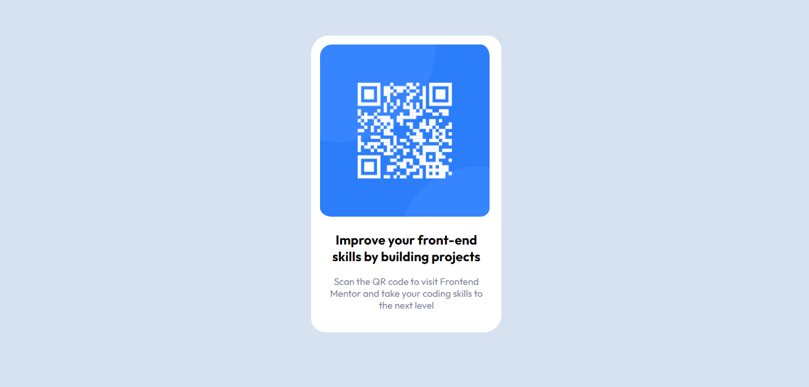
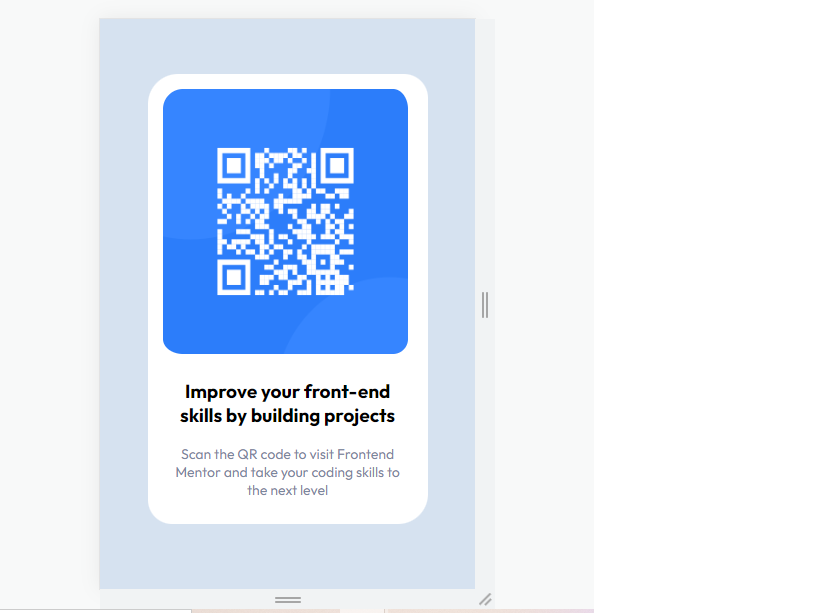

# Frontend Mentor - QR code component

## Descrição:
    Bem-vindo! 👋
    Obrigado por conferir a minha resolução do desafio iniciante do Frontend Mentor, pois este é o meu primeiro desafio. 
    

## Dificuldades:
    Geral:Já na questão do tamanho também tive dificuldades nos tamanhos das imagens e dos espaçamentos.
    Flex:Nessa etapa tive algumas dificuldades pois ainda não me aperfeiçoei ainda na parte de flexbox.
    Responsivo:Já nessa etapa tive dificuldades em deixar as imagens o mais proximo possivel do desafio proposto.

## Técnologias Utilizadas:
    HTML 5
    CSS 3
